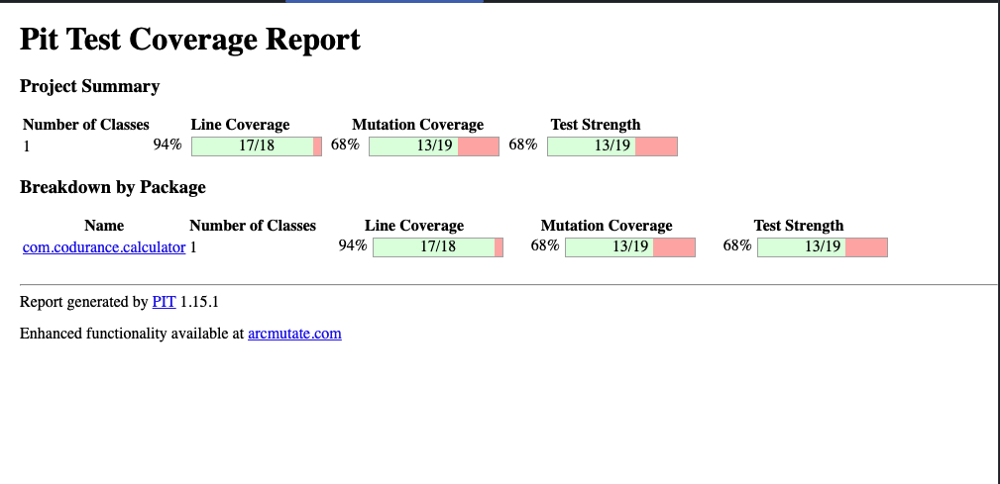
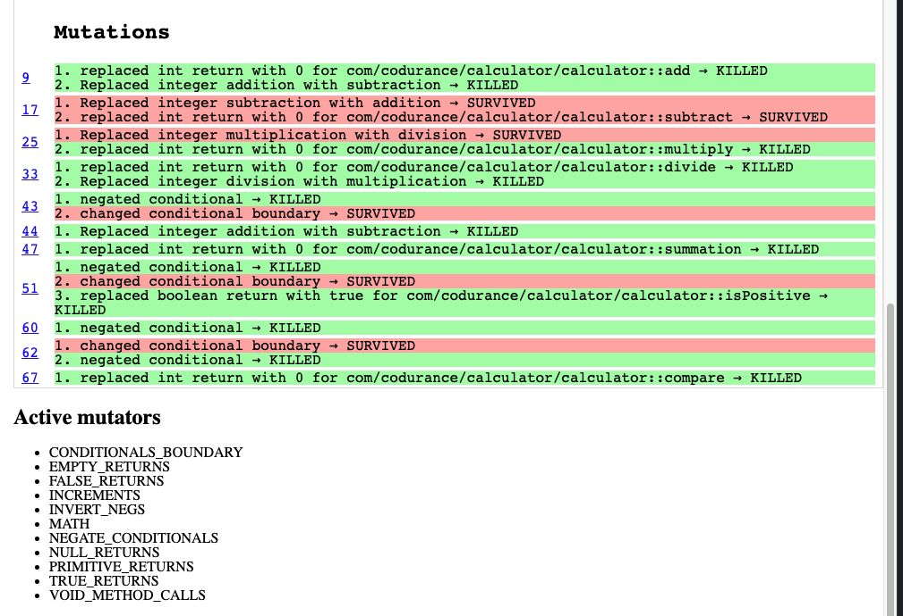

# Mutation test with Java and PITest

## Setup

This code has been tested with JUnit5 and PITest, the project is configured using maven's pom.xml file. No actions are required for setup since all the configuration is already implemented.

## Running the tests

For running the unit tests execute
```shell
mvn clean verify
```

For running the mutation tests:
```shell
mvn clean verify test-compile org.pitest:pitest-maven:mutationCoverage
```
You should get the general output in target/pit-reports/index.html You can navigate to any of the classes reports from here.

Also, a folder will be created for any of the tested classes with its results in target/pit-reports/com.codurance.calculator.

The results will show all the modifications performed in the tested class and a summary of the mutations and active mutators.


