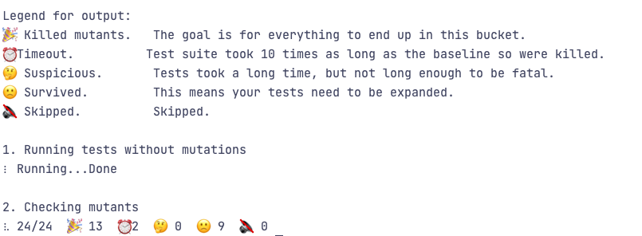

# Mutation test with Python and Mutmut

## Setup

This code has been tested with python 3.10 and using poetry. To get the packages just go to the `python_mutation_tests` folder
and run `poetry install` once you have poetry installed in your system.

## Running the tests

For running the unitests execute
```shell
poetry run pytest
```

For running the mutation tests:
```shell
poetry run mutmut run --paths-to-mutate ./calculator
```

You should get something similar to:
